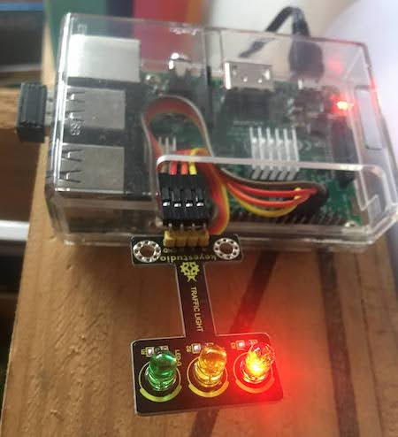

# py-grow-clock

### A kid sleep trainer similar to the grow clock concept
Basically, this project is just a traffic light to help kids regulate their sleep.

So this is my current schedule but feel free to change it, it is trivial to understand (thanks to the [scheduler functions](https://pypi.org/project/schedule/)):

- 7pm : AMBER, bedtime and story time
- 7.30pm : RED, time to close your eyes and start sleeping
- 6.30am : AMBER, if you are awake, you can read book or play quietly in your room
- 7am : GREEN, time to get out of bed and make breakfast (yeah right...)!

Then it's green until 7pm again. This schedule is a classic New Zealand kid bedtime but I know other countries put their kids down later or earlier so feel free to play around.

#### What you will need
- A Raspberry Pi (I am pretty sure an Arduino will do the work as well)
- LEDS or traffic light modules with mounted leds on it (and the cables if needed, some traffic modules don't need cables)
- If you can't access the raspberry Pi via the network you'll probably need a monitor, keyboard and a mouse to create the files on it.

#### How to connect the LEDs

There is a really good course on the [official raspberry pi website](https://projects.raspberrypi.org/en/projects/traffic-lights-python/1) on how to connect the LEDs

### Installation

Grab the content of the `traffic.py` file and add it in a repo in your Raspberry Pi. This file will handle the light switch. By default the light will be red, and the cycle will start after the first time iteration.

You will need the `schedule` module to make it work, I suggest to install Python3 and pip install with pip3.

[How to install pip3](https://www.educative.io/edpresso/installing-pip3-in-ubuntu)
[How to install schedule](https://pypi.org/project/schedule/) (using pip3 and not pip)

Then you need create a launcher file to start the program, that's the job of `launcher.sh`

And finally you probably need the script to load on boot, so here is how to create a quick cronjob.

- Move `launcher.sh` in a folder in your Raspberry Pi (`home/pi` will do)
- Make it an executable by running `chmod 755 launcher.sh`
- Quick test via `sh launcher.sh`
This should run your `traffic.py` code

Then we need to create a log to check what's happening:

Navigate to home directory :
`cd`

Create the directory :
`mkdir logs`

Create the cron
`sudo crontab -e`

Enter this line at the bottom of the file :
`@reboot sh /home/pi/launcher.sh >/home/pi/logs/cronlog 2>&1`

Then reboot to check that the script start on boot :
`sudo reboot`

If it doesn't work, check the logs:
`cd logs`
`cat cronlog`

Thanks to [this article](https://www.instructables.com/Raspberry-Pi-Launch-Python-script-on-startup/)

